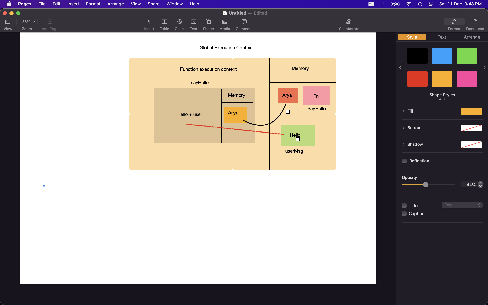
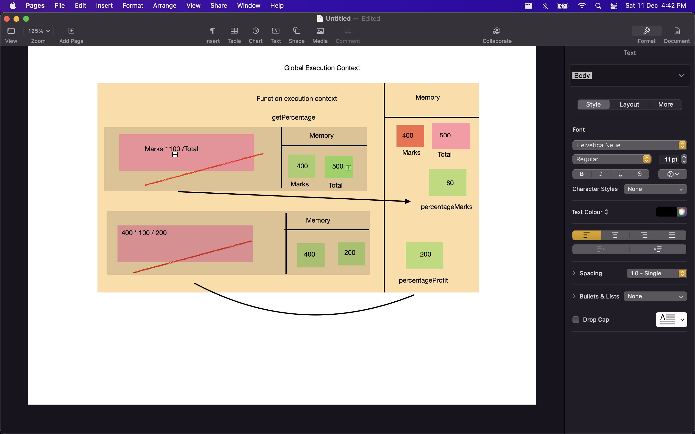
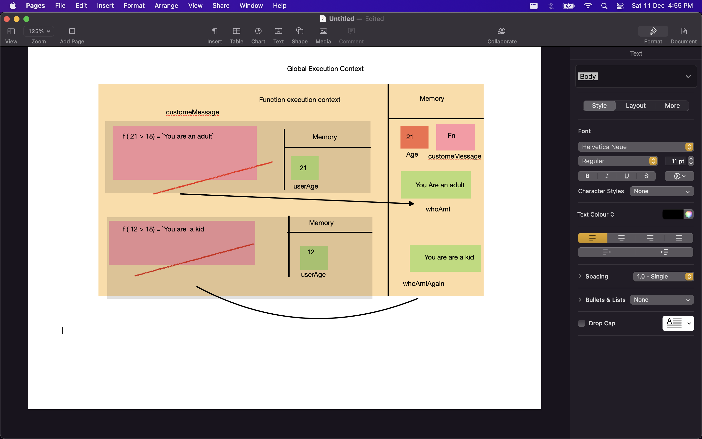

1. What does thread of execution means in JavaScript?
- execution of running multiple tasks or programs at same time.

2. Where the JavaScript code gets executed?
- Global execution context.


3. What does context means in Global Execution Context?
- Context is environment in which you are executing the code.


4. When do you create a global execution context.
- When we execute the code sinnepet JavaScript engine create global execution context.
It created only once for each programme.


5. Execution context consists of what all things?
- Memory Section - to storing data.
- execution section - to execute programe line by line.


6. What are the different types of execution context?
- Global execution context
- function exection context.


7. When global and function execution context gets created?
- When we execute the code snnipet JavaScript engine create global execution context.
It created only once for each programme.
- function execution context - it get created when ever you are executing function.


8. Function execution gets created during function execution or while declaring a function.
-function execution

9. Create a execution context diagram of the following code on your notebook. Take a screenshot/photo and store it in the folder named `img`. Use `` to display it here.


```js
var user = "Arya";

function sayHello(){
  return `Hello ${user}`;
}

var userMsg = sayHello(user);
```




```js
var marks = 400;
var total = 500;

function getPercentage(amount, totalAmount){
  return (amount * 100) / totalAmount;
}

var percentageMarks = getPercentage(marks, total);
var percentageProfit = getPercentage(400, 200);
```

<!-- Put your image here -->




```js
var age = 21;

function customeMessage(userAge){
  if(userAge > 18){
    return `You are an adult`;
  }else {
    return `You are a kid`;
  }
}

var whoAmI = customeMessage(age);
var whoAmIAgain = customeMessage(12);
```

<!-- Put your image here -->

